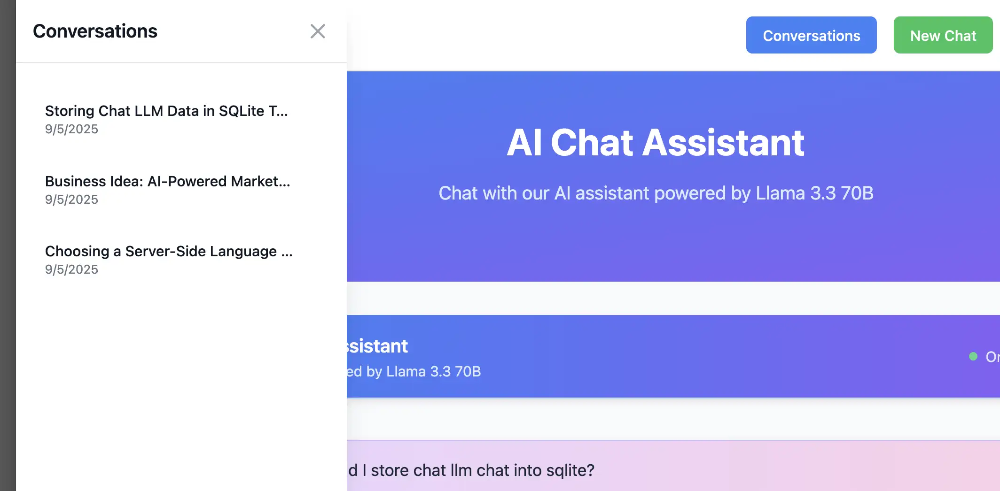
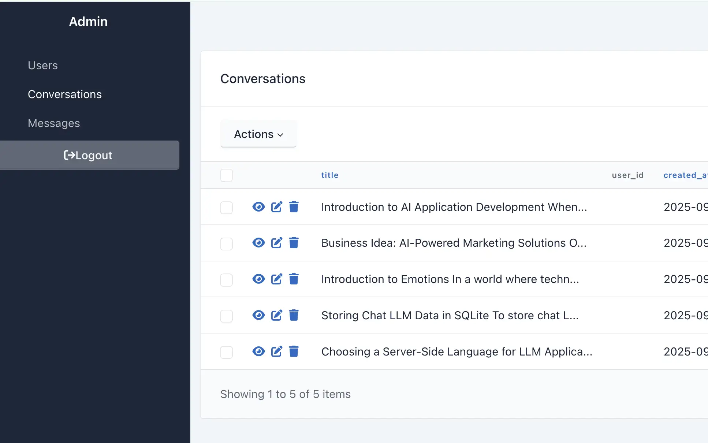

# FastAPI Chat Application with Conversation Management

A modern chat application built with FastAPI, featuring intelligent conversation management, automatic title generation, and persistent chat history.





## Features

### 🤖 **AI Chat Interface**

- Real-time streaming chat with Large Language Models
- Support for both streaming and non-streaming responses
- Clean, modern UI built with HTMX, DaisyUI, Alpine.js, and TailwindCSS

### 📝 **Smart Conversation Management**

- **Automatic Title Generation**: Conversations automatically get meaningful titles based on AI responses instead of generic date-based titles
- **Conversation History**: Persistent storage of all chat conversations and messages
- **Delete Conversations**: Trashcan icon to delete individual conversations
- **Conversation List**: Sidebar showing all conversations with hover effects

### 🗄️ **Data Persistence**

- SQLite database with SQLAlchemy ORM
- Alembic database migrations
- Conversation and message models with proper relationships

### 🔧 **Technical Stack**

- **Backend**: FastAPI with Python
- **Database**: SQLite with SQLAlchemy
- **Frontend**: HTMX + Alpine.js + DaisyUI + TailwindCSS
- **Package Management**: uv
- **Migrations**: Alembic

## Getting Started

### Prerequisites

- Python 3.8+
- uv package manager

### Installation

1. Clone the repository:

```bash
git clone <repository-url>
cd store-retrieve-conversations
```

1. Install dependencies:

```bash
uv sync
```

1. Run database migrations:

```bash
uv run alembic upgrade head
```

1. Start the application:

```bash
uv run python main.py
```

1. Open your browser and navigate to `http://localhost:8000`

## API Endpoints

### Chat Endpoints

- `POST /api/chat/stream` - Stream chat responses
- `POST /api/chat` - Non-streaming chat responses
- `GET /api/chat/conversations` - Get all conversations
- `GET /api/chat/conversations/{conversation_id}` - Get specific conversation
- `DELETE /api/chat/conversations/{conversation_id}` - Delete conversation

### Authentication

- `POST /api/auth/login` - User login
- `POST /api/auth/register` - User registration
- `POST /api/auth/logout` - User logout

## Project Structure

```text
├── admin/                 # Admin interface setup
├── alembic/              # Database migrations
├── auth/                 # Authentication module
├── routes/               # API route handlers
│   ├── auth.py          # Authentication routes
│   ├── chat.py          # Chat API routes
│   └── pages.py         # Page routes
├── services/             # Business logic services
│   ├── chat_service.py  # Chat functionality
│   ├── chat_history_service.py  # Conversation management
│   └── title_generation_service.py  # Auto-title generation
├── templates/            # HTML templates
├── models.py             # Database models
└── main.py              # Application entry point
```

## Key Features Explained

### Automatic Title Generation

The application automatically generates meaningful conversation titles based on the AI's first response. This replaces generic date-based titles with descriptive summaries that help users identify conversations at a glance.

### Conversation Management

- **Create**: New conversations are created automatically when users start chatting
- **Read**: All conversations are displayed in a sidebar with titles and timestamps
- **Update**: Conversation titles are automatically updated after the first AI response
- **Delete**: Users can delete conversations using the trashcan icon

### Modern UI/UX

- Responsive design that works on desktop and mobile
- Real-time updates using HTMX
- Smooth animations and hover effects
- Clean, accessible interface following modern design principles

## Development

### Running Tests

```bash
uv run python -m pytest
```

### Database Migrations

```bash
# Create a new migration
uv run alembic revision --autogenerate -m "Description of changes"

# Apply migrations
uv run alembic upgrade head
```

### Code Style

The project follows Python best practices and uses:

- Type hints throughout
- Async/await patterns
- Proper error handling
- Clean separation of concerns

## Contributing

1. Fork the repository
2. Create a feature branch
3. Make your changes
4. Add tests if applicable
5. Submit a pull request

## License

This project is for educational and testing purposes.
