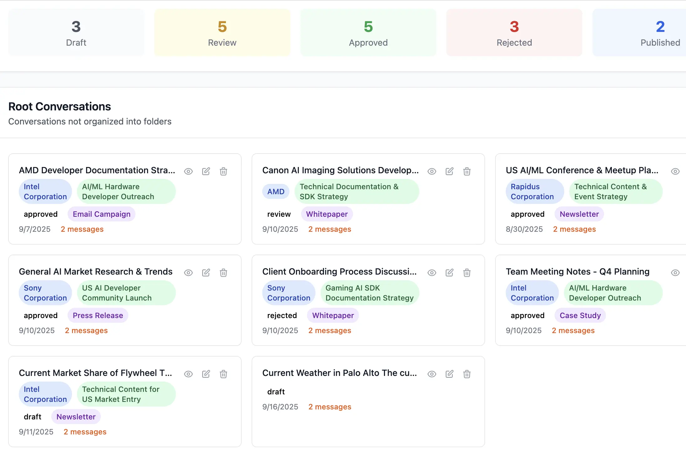
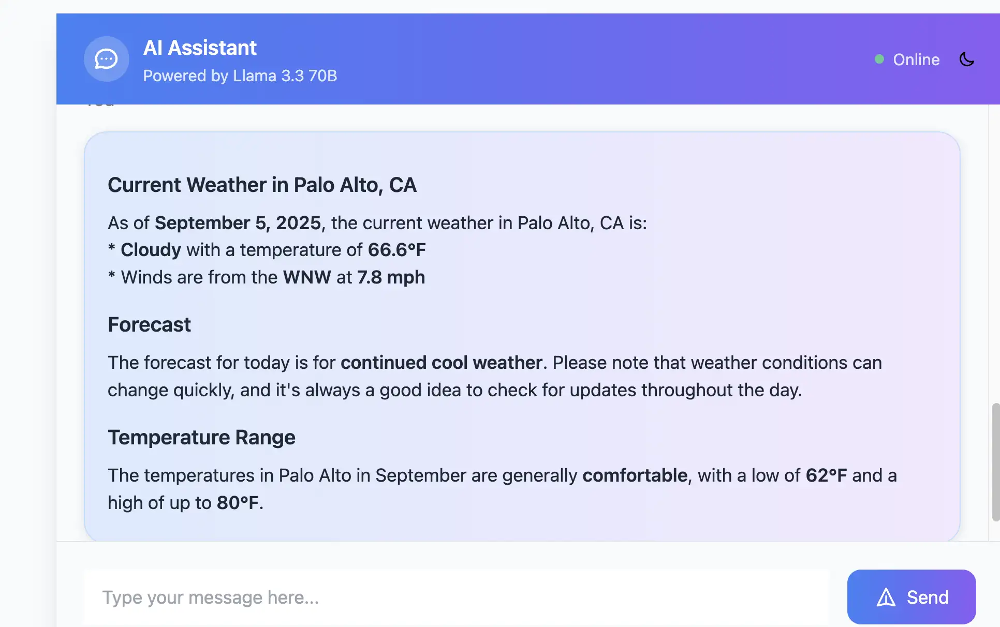

# FastAPI Chat Application with Conversation Management

A modern chat application built with FastAPI, featuring intelligent conversation management, automatic title generation, and persistent chat history.




Web Search



## Features

### 🤖 **AI Chat Interface**

- Real-time streaming chat with Large Language Models
- Support for both streaming and non-streaming responses
- **Intelligent Web Search Integration**: Automatically searches the web for current information when needed
- Clean, modern UI built with HTMX, DaisyUI, Alpine.js, and TailwindCSS

### 📝 **Smart Conversation Management**

- **Automatic Title Generation**: Conversations automatically get meaningful titles based on AI responses instead of generic date-based titles
- **Conversation History**: Persistent storage of all chat conversations and messages
- **Delete Conversations**: Trashcan icon to delete individual conversations
- **Conversation List**: Sidebar showing all conversations with hover effects
- **Conversation Browser**: Advanced organization with drag-and-drop folder management
  - **Folder Organization**: Create and manage folders to organize conversations
  - **Drag & Drop**: Intuitive drag-and-drop interface to move conversations between folders
  - **Hierarchical Structure**: Support for nested folders and sub-folders
  - **Visual Management**: Clean interface for organizing and browsing conversations

### 🗄️ **Data Persistence**

- SQLite database with SQLAlchemy ORM
- Alembic database migrations
- Conversation and message models with proper relationships
- Folder management with hierarchical structure support
- Conversation-folder relationships for organization

### 🔧 **Technical Stack**

- **Backend**: FastAPI with Python
- **Database**: SQLite with SQLAlchemy
- **Frontend**: HTMX + Alpine.js + DaisyUI + TailwindCSS
- **AI/LLM**: OpenRouter API with Llama 3.3 70B
- **Web Search**: Tavily API for real-time information
- **Hybrid Search**: FAISS + FTS5 + OpenAI Embeddings
- **Package Management**: uv
- **Migrations**: Alembic

## Getting Started

### Prerequisites

- Python 3.8+
- uv package manager
- OpenRouter API key (for AI chat functionality)
- Tavily API key (for web search functionality)
- OpenAI API key (for hybrid search embeddings)

### Installation

1. Clone the repository:

```bash
git clone <repository-url>
cd store-retrieve-conversations
```

1. Install dependencies:

```bash
uv sync
```

1. Set up environment variables:

Create a `.env` file in the project root with your API keys:

```bash
OPENROUTER_API_KEY=your_openrouter_api_key_here
TAVILY_API_KEY=your_tavily_api_key_here
OPENAI_API_KEY=your_openai_api_key_here
```

1. Run database migrations:

```bash
uv run alembic upgrade head
```

1. Set up hybrid search (optional but recommended):

```bash
# Chunk existing conversations for search
uv run python -c "
from services.chunking_service import ChunkingService
from services.embedding_service import EmbeddingService
import asyncio

async def setup_search():
    chunking_service = ChunkingService()
    embedding_service = EmbeddingService()
    
    # Chunk all conversations
    total_chunks = await chunking_service.chunk_all_conversations()
    print(f'Created {total_chunks} conversation chunks')
    
    # Generate embeddings for all chunks
    from services.hybrid_search_service import HybridSearchService
    hybrid_service = HybridSearchService(embedding_service)
    await hybrid_service.build_faiss_index()
    print('FAISS index built successfully')

asyncio.run(setup_search())
"
```

1. Start the application:

```bash
uv run python main.py
```

1. Open your browser and navigate to `http://localhost:8000`

### Available Pages

- **Chat Interface**: `http://localhost:8000` - Main chat application
- **Conversation Browser**: `http://localhost:8000/conversation-browser` - Advanced conversation organization
- **Search Interface**: `http://localhost:8000/search` - Hybrid search across conversations and documents
- **Admin Interface**: `http://localhost:8000/admin/` - Database administration

## API Endpoints

### Chat Endpoints

- `POST /api/chat/stream` - Stream chat responses
- `POST /api/chat` - Non-streaming chat responses
- `GET /api/chat/conversations` - Get all conversations
- `GET /api/chat/conversations/{conversation_id}` - Get specific conversation
- `DELETE /api/chat/conversations/{conversation_id}` - Delete conversation
- `GET /api/chat/test` - Test OpenRouter API connection
- `GET /api/chat/web-search/test` - Test Tavily API connection
- `POST /api/chat/web-search` - Perform a direct web search

### Folder Management Endpoints

- `POST /api/folders` - Create a new folder
- `GET /api/folders` - Get all folders (with optional filtering)
- `GET /api/folders/hierarchy` - Get complete folder hierarchy with conversations
- `GET /api/folders/{folder_id}` - Get specific folder details
- `PUT /api/folders/{folder_id}` - Update folder (name, description)
- `DELETE /api/folders/{folder_id}` - Delete folder
- `POST /api/conversations/{conversation_id}/move` - Move conversation to folder
- `GET /api/folders/{folder_id}/conversations` - Get conversations in specific folder

### Search Endpoints

- `GET /search/hybrid` - Hybrid search combining keyword and semantic search
- `GET /search/keyword` - Keyword search using FTS5
- `GET /search/semantic` - Semantic search using FAISS
- `GET /search/conversations` - Search conversations with advanced filtering
- `GET /search/documents` - Search documents with metadata filtering

### Authentication

- `POST /api/auth/login` - User login
- `POST /api/auth/register` - User registration
- `POST /api/auth/logout` - User logout

## Project Structure

```text
├── admin/                 # Admin interface setup
├── alembic/              # Database migrations
├── auth/                 # Authentication module
├── routes/               # API route handlers
│   ├── auth.py          # Authentication routes
│   ├── chat.py          # Chat API routes
│   └── pages.py         # Page routes
├── services/             # Business logic services
│   ├── chat_service.py  # Chat functionality
│   ├── chat_history_service.py  # Conversation management
│   ├── title_generation_service.py  # Auto-title generation
│   ├── folder_service.py  # Folder and organization management
│   ├── web_search_service.py  # Web search integration
│   ├── hybrid_search_service.py  # Hybrid search (FAISS + FTS5)
│   ├── embedding_service.py  # OpenAI embeddings management
│   └── chunking_service.py  # Content chunking for search
├── templates/            # HTML templates
├── models.py             # Database models
└── main.py              # Application entry point
```

## Key Features Explained

### Automatic Title Generation

The application automatically generates meaningful conversation titles based on the AI's first response. This replaces generic date-based titles with descriptive summaries that help users identify conversations at a glance.

### Conversation Management

- **Create**: New conversations are created automatically when users start chatting
- **Read**: All conversations are displayed in a sidebar with titles and timestamps
- **Update**: Conversation titles are automatically updated after the first AI response
- **Delete**: Users can delete conversations using the trashcan icon

### Conversation Browser

The conversation browser provides advanced organization capabilities:

- **Folder Creation**: Create custom folders with names and descriptions to categorize conversations
- **Drag & Drop Interface**: Intuitive drag-and-drop to move conversations between folders
- **Hierarchical Organization**: Support for nested folder structures
- **Visual Management**: Clean, modern interface for organizing conversations
- **Persistent Storage**: All folder assignments are saved to the database
- **Real-time Updates**: Changes are immediately reflected across all interfaces

Access the conversation browser via the "Organize" button in the chat interface or navigate directly to `/conversation-browser`.

### Web Search Integration

The application features intelligent web search capabilities that automatically enhance AI responses with current information:

- **Smart Detection**: The system automatically detects when a user's question requires current information based on keywords and context
- **Real-time Search**: Uses Tavily API to search the web for up-to-date information
- **Seamless Integration**: Search results are automatically included in the AI's context without user intervention
- **Comprehensive Responses**: AI combines its knowledge with current web information to provide comprehensive answers

**Search Triggers**: The system will automatically search the web when users ask about:

- Current events and news
- Real-time information (weather, stock prices, etc.)
- Latest developments in any field
- Recent updates on any topic
- Questions containing keywords like "current", "latest", "recent", "today", "now", "2024", "2025", "news", "update", "happening", "trending", "what's new", "price", "cost", "rate", "stock", "market", "weather"

**Example Queries that Trigger Web Search**:

- "What are the latest AI developments in 2024?"
- "What's the current weather in New York?"
- "What's happening in the stock market today?"
- "What are the recent updates on climate change?"

**Example Queries that Don't Trigger Web Search**:

- "Explain what Python is"
- "How do I cook pasta?"
- "What is the capital of France?"

### 🔍 **Hybrid Search System**

The application features a sophisticated hybrid search system that combines keyword and semantic search for comprehensive content discovery:

#### **Search Technologies**

- **Keyword Search (FTS5 + BM25)**: Uses SQLite's Full-Text Search extension with BM25 ranking for precise keyword matching
- **Semantic Search (FAISS + OpenAI)**: Leverages OpenAI embeddings (1536 dimensions) with FAISS vector similarity search for meaning-based discovery
- **Hybrid Scoring**: Combines both approaches with configurable weights (default: 35% BM25, 65% semantic)

#### **Search Capabilities**

- **Multi-Content Search**: Search across conversations, documents, and all content types
- **Intelligent Chunking**: Content is automatically chunked into searchable pieces for granular discovery
- **Real-time Indexing**: New content is automatically indexed and made searchable
- **Advanced Filtering**: Filter by content type, date ranges, folders, and more
- **Configurable Weights**: Adjust the balance between keyword and semantic search relevance

#### **Search Methods Available**

1. **Hybrid Search** (Recommended): Combines keyword and semantic search for optimal results
2. **Keyword Search**: Traditional text search with BM25 ranking
3. **Semantic Search**: AI-powered meaning-based search
4. **Basic Search**: Simple text matching for quick results

#### **Search Interface Features**

- **Real-time Search**: Results update as you type with debounced input
- **Search Statistics**: Shows result counts and search performance metrics
- **Result Highlighting**: Highlights matching terms in search results
- **Contextual Information**: Shows conversation titles, folder organization, and content metadata
- **Export Capabilities**: Export search results for further analysis

#### **API Endpoints for Search**

- `GET /search/hybrid` - Perform hybrid search with configurable weights
- `GET /search/keyword` - Keyword-only search using FTS5
- `GET /search/semantic` - Semantic-only search using FAISS
- `GET /search/conversations` - Search conversations with advanced filtering
- `GET /search/documents` - Search documents with metadata filtering

#### **Search Use Cases**

- **Content Discovery**: Find relevant conversations and documents across your entire knowledge base
- **Research Assistance**: Locate specific information or related content quickly
- **Knowledge Management**: Organize and retrieve information by meaning, not just keywords
- **Contextual Search**: Find content that's semantically related even with different terminology

### Modern UI/UX

- Responsive design that works on desktop and mobile
- Real-time updates using HTMX
- Smooth animations and hover effects
- Clean, accessible interface following modern design principles

## Development

### Running Tests

```bash
uv run python -m pytest
```

### Database Migrations

```bash
# Create a new migration
uv run alembic revision --autogenerate -m "Description of changes"

# Apply migrations
uv run alembic upgrade head
```

### Code Style

The project follows Python best practices and uses:

- Type hints throughout
- Async/await patterns
- Proper error handling
- Clean separation of concerns

## Contributing

1. Fork the repository
2. Create a feature branch
3. Make your changes
4. Add tests if applicable
5. Submit a pull request

## License

This project is for educational and testing purposes.
