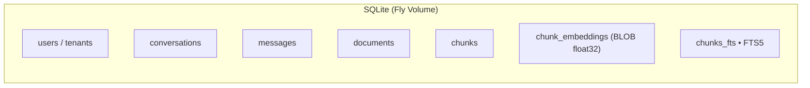
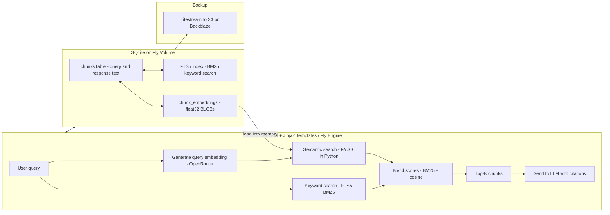

# LLM Cache Plan

1. **Goal** – Store and retrieve LLM conversations + documents more flexibly than ChatGPT’s built-in “projects/folders” model, without extra complexity or high cost.
2. **Constraint** – Cheap deployment on Fly.io, minimal moving parts, easy backups, future scalability.
3. **Decision** – Use SQLite as the **single source of truth**, with both:

   * **FTS5 (BM25)** for keyword search
   * **FAISS** for semantic (embedding) search
     → Blend results for **hybrid retrieval**.
4. **Advantages over ChromaDB** – One DB for all data, no extra server, ACID reliability, hybrid search in same place, portable `.db` file, simple ops with Litestream backups.
5. **FAISS vs sqlite-vec** –

   * FAISS: in-memory ANN index in your Python process, very fast, rebuildable from SQLite.
   * sqlite-vec: vector search built into SQLite (alternative if you want SQL-only queries).
6. **Hybrid Search Benefit** – BM25 = precise keywords, FAISS = meaning match; together cover both exact terms and semantic similarity.

---

## **Recommended Stack**

* **Backend:** FastAPI + Jinja2 templates (Fly Engine).
* **Database:** SQLite on a Fly Volume.
* **Embeddings:** Generated with **OpenRouter API** (store as float32 BLOBs in SQLite).
* **Conversations & Documents:**

  * Store as **chunks** in SQLite (`chunks` table)
  * Mirror into **FTS5** table for BM25 keyword search.
* **Semantic Search:** Store embeddings in SQLite; build **FAISS** index in app memory.
* **Retrieval:**

  1. Get top N keyword matches via BM25 (FTS5).
  2. Get top N semantic matches via FAISS cosine similarity.
  3. Blend scores (e.g., `0.35*BM25 + 0.65*cosine`) to produce final Top-K chunks.
* **Backups:** Litestream to S3/Backblaze for database; FAISS index can be rebuilt.

---

